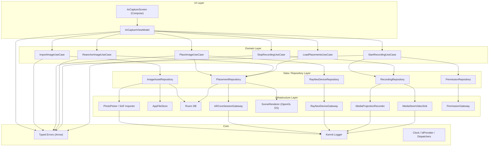
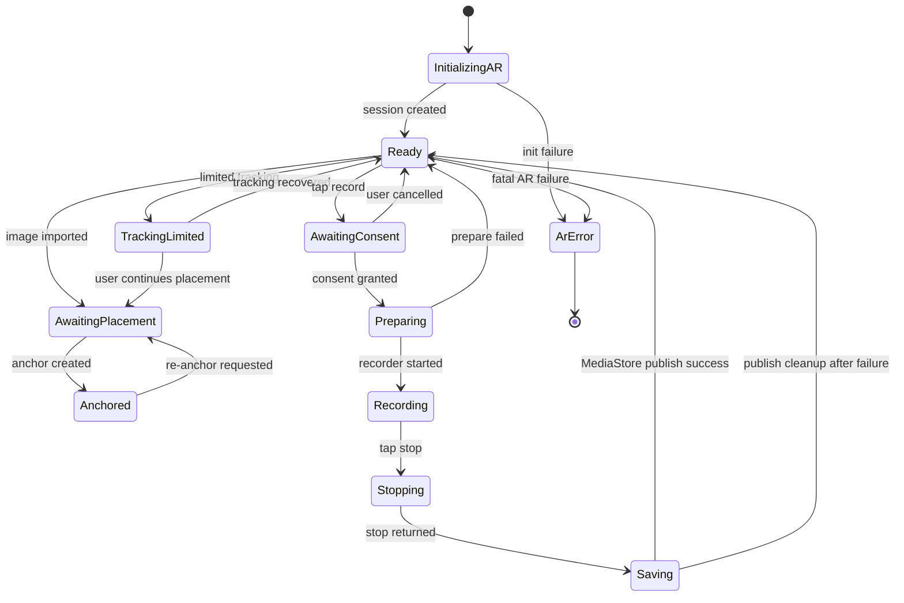
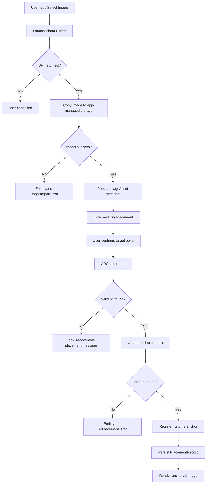
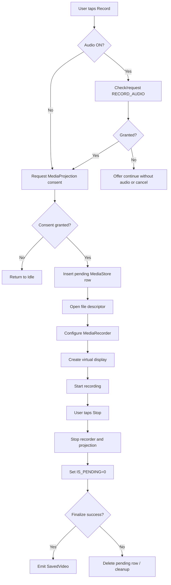
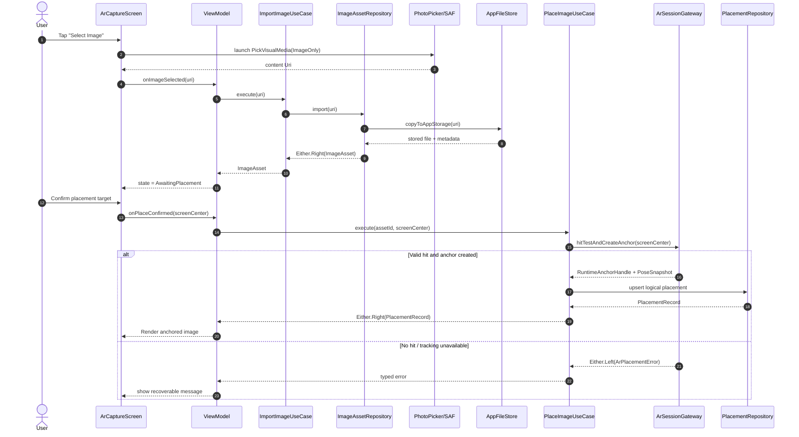
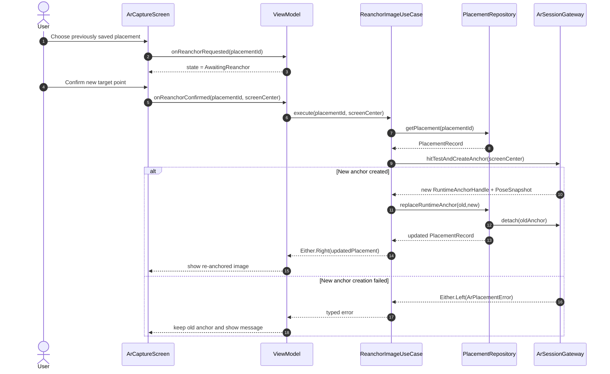
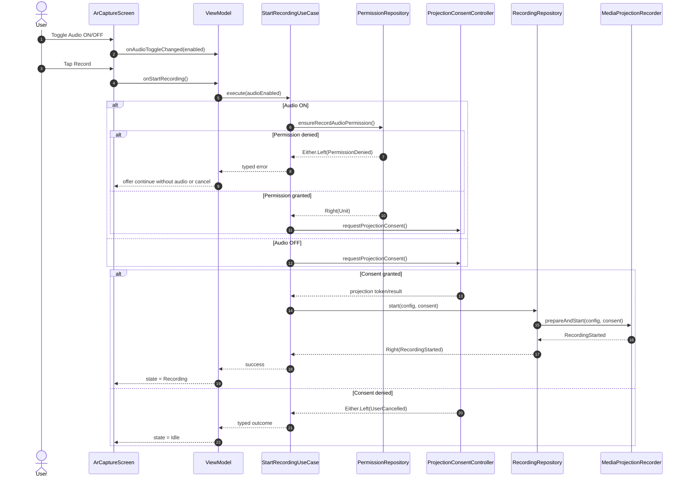
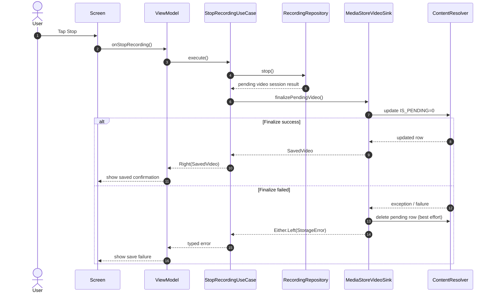

# 1. Executive Summary

This design proposes a modular Kotlin Android AR application for **RayNeo X3 Pro** that lets the user import an image, anchor it in AR space, re-anchor it later, record the AR experience with optional microphone audio, and save recorded videos to local storage. The design assumes a **single-activity Android app** with a **Compose-based shell**, an **ARCore-driven spatial pipeline**, a **RayNeo SDK adapter** for device-specific integration, **Arrow** for typed error propagation, and **Kermit** for structured logging. RayNeo publicly positions X3 Pro as a developer-capable device with **Creator Mode**, **6DoF + SLAM**, **Android/Unity ARDK support**, an **ADB-accessible installation environment**, and a **12MP camera**, but publicly indexed low-level API details are limited; this document therefore isolates RayNeo-specific behavior behind explicit interfaces and flags those parts as assumptions. ([RayNeo][1])

The core architectural decision is to treat **AR placement**, **recording**, **storage**, and **device integration** as separate subsystems. ARCore owns **tracking, hit-testing, anchors, and pose semantics**. RayNeo SDK owns **device-specific display/input/lifecycle integration**. A storage layer owns **image import**, **asset persistence**, **Room metadata**, and **MediaStore video publishing**. Recording is implemented through a recorder abstraction with an MVP implementation based on **MediaProjection + MediaRecorder + MediaStore**. That is the lowest-risk Android-native path for capturing the actual AR app surface the user sees, while still allowing a future fallback to a renderer-level recorder if the RayNeo compositor behaves differently than a standard phone/tablet display stack. Android officially supports Photo Picker for scoped media selection, MediaProjection to capture an app window or device screen onto a `Surface`, and MediaStore-based publication without broad storage permission for app-owned media on Android 10+. ([Android Developers][2])

---

# 2. Scope and Assumptions

## 2.1 In Scope

The MVP supports:

* selecting **one image at a time** from local storage,
* importing it into app-managed storage,
* placing it into AR space,
* re-anchoring that logical image later,
* recording the AR app view,
* optionally including microphone audio,
* saving the resulting video into user-visible local media storage.

## 2.2 Out of Scope

The MVP does **not** include:

* multi-user shared anchors,
* cloud synchronization,
* cross-device anchor persistence,
* multi-image scene authoring,
* remote upload,
* editing recorded video,
* background recording after the app loses foreground.

## 2.3 Confirmed Facts, Assumptions, and Design Choices

| Type           | Item                                                                                                                                                                                               | Status                                                                                      |
| -------------- | -------------------------------------------------------------------------------------------------------------------------------------------------------------------------------------------------- | ------------------------------------------------------------------------------------------- |
| Confirmed fact | RayNeo X3 Pro is marketed with Creator Mode, 6DoF + SLAM, Android/Unity ARDK support, ADB-accessible app installation, open Android environment, and a 12MP camera.                                | Confirmed by RayNeo product pages. ([RayNeo][1])                                            |
| Confirmed fact | ARCore placement should use hit-tests and anchors; anchor numerical pose can change as tracking improves.                                                                                          | Confirmed by ARCore docs. ([Google for Developers][3])                                      |
| Confirmed fact | Android Photo Picker is the preferred scoped selection path and automatically falls back to `ACTION_OPEN_DOCUMENT` when unavailable.                                                               | Confirmed by Android docs. ([Android Developers][2])                                        |
| Confirmed fact | MediaProjection can capture an app window or display onto a `Surface`; each capture session requires user consent, and each `MediaProjection` instance is single-use for `createVirtualDisplay()`. | Confirmed by Android docs. ([Android Developers][4])                                        |
| Confirmed fact | App-owned media can be written to MediaStore without broad storage permission on Android 10+, and `IS_PENDING` / `RELATIVE_PATH` are the correct publication tools.                                | Confirmed by Android docs. ([Android Developers][5])                                        |
| Assumption     | The deployed X3 Pro firmware exposes sufficiently standard Android media and display behavior for MediaProjection-based recording of the AR app surface.                                           | Assumption; validate on target hardware.                                                    |
| Assumption     | RayNeo SDK will be needed primarily for display/input/device integration, not for replacing ARCore anchor semantics in this app.                                                                   | Assumption; public low-level API docs are sparse.                                           |
| Design choice  | MVP supports one active anchored image at a time, while persistence schema supports later extension to multiple logical placements.                                                                | Recommended design choice.                                                                  |
| Design choice  | Imported images are copied into app-managed storage immediately rather than referenced indefinitely through external URIs.                                                                         | Recommended design choice.                                                                  |
| Design choice  | Re-anchoring is implemented as replacing the runtime anchor for a persisted logical image record, not as restoring raw ARCore coordinates across sessions.                                         | Recommended design choice, aligned with ARCore pose semantics. ([Google for Developers][6]) |

---

# 3. Requirements Mapping

| Requirement                          | Primary Use Case                                | Primary Modules                                                    | Notes                                                                             |
| ------------------------------------ | ----------------------------------------------- | ------------------------------------------------------------------ | --------------------------------------------------------------------------------- |
| Select image from local storage      | `ImportImageUseCase`                            | `feature-ar-capture`, `data-assets`, `infra-storage`               | Use Photo Picker; fallback handled by Android contract. ([Android Developers][2]) |
| Place/fix image in AR space          | `PlaceImageUseCase`                             | `domain-placement`, `infra-arcore`, `infra-render`                 | Hit-test then create anchor. ([Google for Developers][3])                         |
| Re-fix previously fixed image        | `ReanchorImageUseCase`                          | `domain-placement`, `data-placement`, `infra-arcore`               | Persist logical placement, not runtime anchor. ([Google for Developers][6])       |
| Record video                         | `StartRecordingUseCase`, `StopRecordingUseCase` | `feature-recording`, `infra-media-projection`, `infra-media-store` | App-window capture preferred. ([Android Developers][4])                           |
| Audio ON/OFF                         | `StartRecordingUseCase`                         | `feature-recording`, `infra-permissions`, `infra-media-projection` | `RECORD_AUDIO` only when ON. ([Android Developers][7])                            |
| Save recorded video to local storage | `FinalizeRecordingUseCase`                      | `infra-media-store`                                                | Save directly into MediaStore video collection. ([Android Developers][8])         |
| Arrow-based typed errors             | All use cases                                   | `core-error`, repositories, adapters                               | Conversion at I/O boundaries only. ([arrow-kt.io][9])                             |
| Kermit logging and adb traceability  | All layers                                      | `core-logging`                                                     | Stable component tags. Kermit defaults to Logcat on Android. ([Kermit][10])       |

---

# 4. Architecture Overview

## 4.1 Architectural Style

The proposed style is **Clean Architecture with explicit SDK adapters**:

* **UI layer**: Compose screen, ViewModel, state reducer, effects.
* **Domain layer**: use cases, domain models, business policies.
* **Data layer**: repositories coordinating persistence and SDK gateways.
* **Infrastructure layer**: ARCore adapter, RayNeo adapter, MediaProjection recorder, MediaStore saver, file importer, Room DAOs.
* **Core layer**: errors, logging, result types, time/ID abstractions, test fixtures.

The design goal is that **feature code never talks directly to ARCore, RayNeo SDK, MediaRecorder, ContentResolver, or Room**. All such dependencies are accessed through interfaces.

## 4.2 Dependency Rule

* `feature-*` depends on `domain-*` and `core-*`
* `domain-*` depends only on `core-*`
* `data-*` depends on `domain-*`, `core-*`, and infrastructure interfaces
* `infra-*` depends on Android SDK / ARCore / RayNeo SDK / Room / Media APIs
* no inward layer depends on UI or on a concrete SDK

## 4.3 Overall Architecture Diagram



---

# 5. Module Decomposition

A practical Gradle multi-module layout:

| Module                | Type                 | Depends On          | Purpose                                    |
| --------------------- | -------------------- | ------------------- | ------------------------------------------ |
| `:app`                | Android app          | all feature modules | Composition root, DI wiring, manifest      |
| `:core:model`         | Kotlin               | none                | IDs, value objects, common enums           |
| `:core:error`         | Kotlin               | `:core:model`       | sealed typed errors, Arrow aliases         |
| `:core:logging`       | Kotlin               | Kermit              | log tags, logger factory, redaction        |
| `:core:test`          | Kotlin test fixtures | core modules        | fakes, builders, test dispatchers          |
| `:domain:placement`   | Kotlin               | core modules        | placement and re-anchor use cases          |
| `:domain:recording`   | Kotlin               | core modules        | recording use cases                        |
| `:data:assets`        | Android/Kotlin       | domain + core       | image import and asset persistence         |
| `:data:placement`     | Android/Kotlin       | domain + core       | placement repo + runtime anchor registry   |
| `:data:recording`     | Android/Kotlin       | domain + core       | recorder orchestration + save              |
| `:infra:arcore`       | Android              | core                | session config, hit-test, anchors          |
| `:infra:renderer`     | Android              | core                | textured quad renderer                     |
| `:infra:rayneo`       | Android              | core                | device display/input/lifecycle adapter     |
| `:infra:storage`      | Android              | core                | file copy, app storage, MediaStore         |
| `:infra:permissions`  | Android              | core                | CAMERA / RECORD_AUDIO / projection consent |
| `:infra:persistence`  | Android              | core                | Room entities, DAO, mappers                |
| `:feature:ar-capture` | Android              | domain + core       | Compose UI, ViewModel, reducer             |

---

# 6. Responsibility of Each Module

## 6.1 `:feature:ar-capture`

Owns:

* Compose UI
* user intents
* UI state machine
* one ViewModel coordinating all use cases
* effect emission: snackbar, dialog, navigation, permission prompts

Does **not** own:

* ARCore API calls
* storage API calls
* MediaRecorder API calls
* exception translation

## 6.2 `:domain:placement`

Owns:

* image placement business rules
* re-anchor policy
* placement lifecycle state transitions
* validation such as “image must exist before placement”
* decision to replace old runtime anchor only after new anchor succeeds

## 6.3 `:domain:recording`

Owns:

* start/stop recording orchestration
* audio-enabled policy
* gating on permissions and projection consent
* mapping infrastructure failures to user-facing outcomes

## 6.4 `:data:assets`

Owns:

* importing user-selected image
* copying selected content into app-managed storage
* extracting metadata
* maintaining stable `ImageAssetId`

## 6.5 `:data:placement`

Owns:

* logical placement persistence
* runtime anchor registry for current session
* mapping between persisted placement record and live AR anchor handle
* detach/replace logic during re-anchor

## 6.6 `:infra:arcore`

Owns:

* ARCore `Session` lifecycle
* session configuration
* tracking observation
* hit-testing
* anchor creation/detachment
* camera permission preconditions

ARCore is the correct place for **world understanding, hit-test result types, anchors, and pose access**. ARCore explicitly documents hit-testing and anchor creation from hit results, as well as anchor pose updates and per-frame world-space adjustments. ([Google for Developers][3])

## 6.7 `:infra:rayneo`

Owns:

* device-specific display and app-mode initialization
* RayNeo “Creator Mode” setup checks
* device input adaptation if using RayNeo touch/gesture hardware
* stereo/display hooks
* device capability queries

RayNeo SDK logic is intentionally isolated here because public indexed documentation confirms developer-oriented device features but does not expose enough low-level API surface to safely leak into domain/UI design. ([RayNeo][1])

## 6.8 `:infra:renderer`

Owns:

* AR background rendering integration
* textured quad rendering for selected image
* image scaling, aspect ratio, alpha, z-order policy
* frame-synchronized draw calls

## 6.9 `:infra:storage`

Owns:

* Photo Picker / SAF integration support
* file copy to app-private storage
* MediaStore row creation and finalization for videos
* app-specific cache/temp management

## 6.10 `:infra:permissions`

Owns:

* CAMERA runtime permission request result mapping
* RECORD_AUDIO runtime permission request result mapping
* MediaProjection consent launcher result mapping

---

# 7. Data Structures / Domain Models

## 7.1 Core Value Objects

```kotlin
@JvmInline value class ImageAssetId(val value: String)
@JvmInline value class PlacementId(val value: String)
@JvmInline value class SessionId(val value: String)
@JvmInline value class RuntimeAnchorId(val value: String)
```

## 7.2 Image Asset

```kotlin
data class ImageAsset(
    val id: ImageAssetId,
    val storedPath: String,          // app-managed file path or Uri string
    val originalDisplayName: String?,
    val mimeType: String,
    val widthPx: Int,
    val heightPx: Int,
    val byteSize: Long,
    val sha256: String,
    val importedAtEpochMs: Long
)
```

## 7.3 Placement Record

```kotlin
data class PlacementRecord(
    val id: PlacementId,
    val imageAssetId: ImageAssetId,
    val displayWidthMeters: Float,
    val status: PlacementStatus,
    val lastAnchorSnapshot: PoseSnapshot?,
    val activeSessionId: SessionId?,
    val updatedAtEpochMs: Long
)

enum class PlacementStatus {
    Unplaced,
    AnchoredInSession,
    RequiresReanchor
}
```

## 7.4 Pose Snapshot

```kotlin
data class PoseSnapshot(
    val translationMeters: FloatArray,    // size 3
    val rotationQuaternion: FloatArray,   // size 4
    val source: HitResultType
)

enum class HitResultType {
    Depth,
    Plane,
    FeaturePoint,
    InstantPlacement
}
```

**Important rule:** `PoseSnapshot` is persisted as **diagnostic/history metadata only**. It is **not** used to reconstruct a valid ARCore world anchor in a future session, because ARCore world coordinates can shift as scene understanding improves and are frame-relative in practice unless tied to an anchor or a persistent cloud/geospatial mechanism. ([Google for Developers][6])

## 7.5 Runtime Anchor Handle

```kotlin
data class RuntimeAnchorHandle(
    val runtimeAnchorId: RuntimeAnchorId,
    val placementId: PlacementId,
    val sessionId: SessionId
)
```

This object is **never persisted**.

## 7.6 Recording Models

```kotlin
data class RecordingConfig(
    val audioEnabled: Boolean,
    val preferredCaptureMode: CaptureMode,
    val displayName: String,
    val relativePath: String = "Movies/RayNeoAR"
)

enum class CaptureMode {
    AppWindowPreferred,
    FullDisplayFallback
}

data class PendingVideo(
    val contentUri: String,
    val fileDescriptorInt: Int? = null
)

data class SavedVideo(
    val contentUri: String,
    val displayName: String,
    val relativePath: String,
    val durationMs: Long?
)
```

## 7.7 UI State

```kotlin
data class ArCaptureUiState(
    val arSessionState: ArSessionUiState,
    val importedImage: ImageAsset?,
    val activePlacement: PlacementRecord?,
    val savedPlacements: List<PlacementRecord>,
    val placementMode: PlacementMode,
    val recordingState: RecordingUiState,
    val micToggleEnabled: Boolean,
    val micRequested: Boolean,
    val transientMessage: UiMessage?
)
```

---

# 8. State Management Design

## 8.1 State Model

Use a **single ViewModel** with immutable state and reducer-style updates.

### AR session state

* `Initializing`
* `Ready`
* `TrackingLimited`
* `TrackingLost`
* `Error`

### placement mode

* `Idle`
* `AssetImported`
* `AwaitingPlacement`
* `Anchored`
* `AwaitingReanchor`

### recording state

* `Idle`
* `AwaitingConsent`
* `Preparing`
* `Recording`
* `Stopping`
* `Saving`
* `Saved`
* `Failed`

## 8.2 State Ownership

| State                        | Owner                                       |
| ---------------------------- | ------------------------------------------- |
| Current image asset          | ViewModel + Room-backed repo                |
| Live AR anchor handle        | Runtime anchor registry in `data:placement` |
| Persisted placement metadata | Room                                        |
| Recording in progress        | `data:recording` repository                 |
| Permission/consent outcomes  | `infra:permissions`                         |

## 8.3 State Diagram



## 8.4 State Transition Rules

* `re-anchor` is only allowed if a logical placement exists.
* microphone toggle is editable only when `recordingState == Idle`.
* AR session errors preempt placement actions.
* recording stop always transitions through `Saving`, even on failure, to guarantee cleanup.

---

# 9. Detailed Processing Flows

## 9.1 Import and Place Image

1. User taps **Select Image**.
2. UI launches `PickVisualMedia(ImageOnly)`.
3. Android returns a content URI through Photo Picker, or `ACTION_OPEN_DOCUMENT` on fallback-capable devices.
4. `ImportImageUseCase` copies the content into app-managed storage.
5. Asset metadata is extracted and stored.
6. UI enters `AwaitingPlacement`.
7. User confirms placement with center reticle / gesture action.
8. `PlaceImageUseCase` requests AR hit-test at current target point.
9. `ArSessionGateway` prefers hit types in this order:

   * `Depth`
   * `Plane`
   * `FeaturePoint`
   * `InstantPlacement`
10. Gateway creates anchor from the chosen hit result.
11. Runtime anchor handle is registered.
12. Logical placement record is persisted as `AnchoredInSession`.

ARCore documents that hit-tests return multiple result types and that anchors should be created from the chosen `HitResult`; depth-based hits are available when depth mode is enabled. ([Google for Developers][3])

### Failure path

* URI cannot be opened → typed `ImageImportError.SourceNotFound`
* permission revoked mid-import → `ImageImportError.PermissionRevoked`
* no hit result → `ArPlacementError.NoSurfaceFound`
* tracking limited/lost → `ArPlacementError.TrackingUnavailable`

### Recovery path

* user can retry import
* user can retry placement when tracking improves
* previous imported asset remains loaded until replaced

## 9.2 Re-anchor Existing Image

1. User selects an existing placement record from saved placements.
2. UI enters `AwaitingReanchor`.
3. User points to a new target and confirms.
4. Use case requests new anchor creation.
5. New anchor is created first.
6. Only after success, old runtime anchor is detached.
7. Logical placement record is updated:

   * new pose snapshot
   * `status = AnchoredInSession`
   * new `activeSessionId`
   * updated timestamp

ARCore recommends detaching anchors that are no longer needed because they incur ongoing processing overhead. ([Google for Developers][6])

### Failure path

* placement record missing → `PlacementError.NotFound`
* no valid AR hit → `ArPlacementError.NoSurfaceFound`
* new anchor creation fails → old anchor remains active

### Recovery path

* remain in `AwaitingReanchor`
* retry without losing prior active placement

## 9.3 Start Recording

1. User toggles audio ON/OFF.
2. User taps **Record**.
3. If audio is ON:

   * request `RECORD_AUDIO` if not already granted.
4. Request MediaProjection consent for this recording session.
5. Create pending MediaStore row for destination video.
6. Open destination file descriptor.
7. Configure MediaRecorder:

   * video source: `SURFACE`
   * optional audio source: `MIC`
   * output file descriptor: MediaStore-backed FD
8. Start MediaProjection virtual display with recorder surface.
9. Transition to `Recording`.

Android documents MediaProjection as capture to a virtual display backed by a `Surface`, including `MediaRecorder`, and documents `MediaRecorder` microphone capture through `setAudioSource(MIC)`. Android 14+ also requires fresh user consent for each capture session. ([Android Developers][4])

## 9.4 Stop and Save Recording

1. User taps **Stop**.
2. Recorder stops.
3. MediaProjection resources are released.
4. MediaStore `IS_PENDING` is set from `1` to `0`.
5. Final metadata is committed.
6. UI shows saved result.

Android documents `IS_PENDING` as the mechanism to hide a file until writing is complete and `RELATIVE_PATH` as the hint for location within shared storage. ([Android Developers][8])

### Failure path

* stop throws `IllegalStateException`
* file descriptor write fails
* MediaStore row update fails

### Recovery path

* best-effort cleanup:

  * stop projection
  * release recorder
  * delete pending row if unrecoverable
* UI reports typed error and returns to idle

---

# 10. Flow Diagrams

## 10.1 Image Import and Placement Flow



## 10.2 Recording Flow



---

# 11. Sequence Diagrams

## 11.1 Image Selection and AR Anchoring



## 11.2 Re-anchoring Flow



## 11.3 Video Recording with Audio ON/OFF



## 11.4 Save-to-Local-Storage Flow



---

# 12. Storage Design

## 12.1 Imported Images

### Chosen design

* **Immediate copy** from picker-provided URI into **app-private internal storage**.
* Persist metadata in Room.
* Render from the copied local file, not from external shared URI.

### Rationale

This avoids long-lived dependency on external URI grants, simplifies testing, and keeps re-anchoring independent of whether the original source app or provider changes. Android documents app-private internal storage as accessible only to the app and not requiring storage permissions, while noting that app-specific storage is removed on uninstall. ([Android Developers][11])

### Trade-off

* Imported assets are removed when the app is uninstalled.
* If future requirements demand user-visible imported images outside the app, add export support later.

## 12.2 Placement Persistence

Use Room:

### `image_assets`

* `id`
* `stored_path`
* `display_name`
* `mime_type`
* `width_px`
* `height_px`
* `byte_size`
* `sha256`
* `imported_at`

### `placements`

* `id`
* `image_asset_id`
* `display_width_meters`
* `status`
* `last_pose_tx`
* `last_pose_ty`
* `last_pose_tz`
* `last_pose_qx`
* `last_pose_qy`
* `last_pose_qz`
* `last_pose_qw`
* `last_hit_type`
* `active_session_id`
* `updated_at`

## 12.3 Video Output

Recordings are saved directly to the shared **MediaStore Video** collection with:

* `DISPLAY_NAME = "rayneo_ar_yyyyMMdd_HHmmss.mp4"`
* `MIME_TYPE = "video/mp4"`
* `RELATIVE_PATH = "Movies/RayNeoAR"`
* `IS_PENDING = 1` during write
* `IS_PENDING = 0` after successful finalization

Android explicitly recommends `RELATIVE_PATH` for placement hints and `IS_PENDING` for exclusive write-then-publish semantics. App-owned media can be added to MediaStore without broad storage permission on Android 10+. ([Android Developers][8])

## 12.4 Why Not Save to App-Specific Storage First?

That would create an unnecessary second copy and additional failure points. Direct-to-MediaStore recording is cleaner because `MediaRecorder` can write to a real file descriptor and MediaStore already supports staged publication via `IS_PENDING`. ([Android Developers][8])

---

# 13. AR Placement / Re-anchoring Design

## 13.1 ARCore vs RayNeo SDK Separation

### ARCore responsibilities

* session lifecycle
* tracking state
* hit-testing
* anchor creation
* anchor pose reads
* detaching obsolete anchors

### RayNeo SDK responsibilities

* Creator Mode / device mode checks
* device-specific display behavior
* input adaptation for glasses controls
* stereo/display tuning hooks
* app-launch/runtime integration specific to X3 Pro

This separation is deliberate. RayNeo confirms device-level spatial/developer capabilities, but ARCore is still the authoritative source for hit-tests, anchors, and pose semantics in this design. ([RayNeo][1])

## 13.2 Placement Policy

Use hit-test priority:

1. `Depth`
2. `Plane`
3. `FeaturePoint`
4. `InstantPlacement` only as fallback

Reason:

* `Depth` gives best arbitrary-surface placement when supported.
* `Plane` is stable for large wall/floor surfaces.
* `FeaturePoint` is a weaker fallback.
* `InstantPlacement` is acceptable only when fast UX is preferable to initial precision.

ARCore documents these hit result types and their intended usage. ([Google for Developers][3])

## 13.3 Image Rendering Policy

* Imported image is rendered as a **single textured quad**.
* Default width in world space: **0.35 m**
* Height derived from source aspect ratio.
* Billboard mode: **disabled** by default; quad remains fixed in world orientation.
* Allow future option for user resize/rotate, but not in MVP.

## 13.4 Re-anchoring Policy

Re-anchoring is modeled as:

* same `PlacementId`
* same `ImageAssetId`
* new runtime anchor
* old runtime anchor detached after new anchor succeeds
* `lastAnchorSnapshot` overwritten

This satisfies “re-fix a previously fixed image” without pretending that raw previous ARCore coordinates remain globally valid. That matters because ARCore explicitly warns that world coordinates and anchor numerical locations can be adjusted as understanding improves. ([Google for Developers][6])

## 13.5 Session Restoration Behavior

On app restart:

* placements are loaded from Room
* any placement with no live runtime anchor is surfaced as `RequiresReanchor`
* UI shows thumbnail and “Re-anchor” action

This is the correct behavior for local anchors. **Cloud Anchors are intentionally not used in MVP** because they add external service dependencies, ARCore API enablement, additional hosting/resolution steps, and lifetime/auth constraints not required by the stated requirement. ARCore documents that Cloud Anchors must be explicitly enabled and hosted/resolved through dedicated flows. ([Google for Developers][12])

---

# 14. Video Recording Design

## 14.1 Chosen MVP Recording Path

**MediaProjection + MediaRecorder + MediaStore**

### Why

* captures the rendered AR app window the user actually sees,
* fits Android-native consent and privacy model,
* avoids building a full custom dual-surface render encoder path in MVP,
* keeps recorder isolated behind an interface for future replacement.

Android documents that MediaProjection captures a display or app window onto a `Surface`, and that `MediaRecorder` can provide that surface. Android 14 app screen sharing can limit capture to the selected app content rather than the whole display. ([Android Developers][4])

## 14.2 Recorder Components

### `ProjectionConsentController`

* launches `createScreenCaptureIntent()`
* returns typed outcome

### `MediaProjectionRecorder`

* obtains `MediaProjection`
* registers `onStop()` callback
* creates virtual display
* binds recorder surface

### `MediaStoreVideoSink`

* inserts pending MediaStore row
* opens PFD
* finalizes or deletes on failure

Android 14 requires one consent per capture session and requires callback registration; missing callback registration can cause `IllegalStateException` on `createVirtualDisplay()`. ([Android Developers][13])

## 14.3 Recorder Configuration

Suggested defaults:

* format: MP4
* encoder: H.264 / AVC
* frame rate: 30 fps
* bitrate: tuned after device validation, start around 8–12 Mbps
* audio: AAC when enabled
* output: MediaStore PFD

These are design choices, not platform facts.

## 14.4 Lifecycle Guarantees

`RecordingRepository` guarantees:

* idempotent stop cleanup
* recorder release on every terminal path
* projection release on every terminal path
* pending MediaStore row cleanup on fatal failure

## 14.5 Alternative Path Reserved

Define:

```kotlin
interface RecorderEngine {
    suspend fun start(config: RecordingConfig, consent: ProjectionConsent): Either<RecordingError, Unit>
    suspend fun stop(): Either<RecordingError, SavedVideo>
}
```

Future engines:

* `MediaProjectionRecorderEngine` (MVP)
* `GlCompositorRecorderEngine` (future, if RayNeo compositor proves incompatible)

---

# 15. Audio ON/OFF Control Design

## 15.1 UX Rules

* microphone default is **OFF**
* user can toggle before recording starts
* toggle is locked during active recording
* if user requests audio ON and denies mic permission:

  * offer **Continue without audio**
  * or **Cancel**

## 15.2 Technical Behavior

### Audio OFF

* do not request `RECORD_AUDIO`
* do not call `setAudioSource()`
* create video-only recording session

### Audio ON

* ensure runtime `RECORD_AUDIO`
* configure `MediaRecorder.setAudioSource(MIC)`
* include audio encoder

Android documents `RECORD_AUDIO` as a runtime-sensitive permission and documents `MediaRecorder` microphone setup via `setAudioSource(MIC)`. It also notes that apps in background cannot access the microphone on Android 9+ unless appropriate foreground-service behavior is used; this design keeps recording foreground-only. ([Android Developers][7])

## 15.3 Domain Rule

Audio mode becomes immutable once `StartRecordingUseCase` succeeds. Mid-recording mode switches are rejected as `RecordingError.InvalidState`.

---

# 16. Permission Handling Design

## 16.1 Required Permissions / Consents

| Capability           | Mechanism                                                    |
| -------------------- | ------------------------------------------------------------ |
| AR camera access     | `CAMERA` manifest + runtime                                  |
| Microphone recording | `RECORD_AUDIO` manifest + runtime, only when audio ON        |
| Screen/app capture   | MediaProjection consent prompt per session                   |
| Image selection      | Photo Picker, no broad media read permission in primary path |

Android permission docs require declaring app permissions in the manifest and requesting runtime permissions when needed. Android also recommends minimizing declared permissions. ([Android Developers][14])

## 16.2 Why `READ_MEDIA_IMAGES` Is Not in the Primary Path

For this app, the user chooses a single image through Photo Picker. Android explicitly recommends Photo Picker as a safe built-in way to grant access to selected media only, and the support contract falls back to `ACTION_OPEN_DOCUMENT` when the picker is unavailable. Therefore, the primary design does **not** request `READ_MEDIA_IMAGES`. That permission becomes necessary only if a future feature reads arbitrary shared images outside user-picked URIs. ([Android Developers][2])

## 16.3 Permission Timing

* `CAMERA`: requested when entering AR capture screen
* `RECORD_AUDIO`: requested only when user starts recording with audio ON
* MediaProjection: requested each time recording starts

## 16.4 Degraded Behavior

* camera denied → AR screen enters blocked state
* microphone denied → allow video-only recording
* projection consent denied → no recording starts

---

# 17. Error Handling Design with Arrow

## 17.1 Design Rule

Arrow is used for **typed logical failures**. Repositories and infrastructure adapters convert recoverable exceptions into typed errors at the **outer I/O boundary**. Use cases and UI consume **typed errors only**. Arrow officially supports both `Either` and `Raise` styles for typed errors. ([arrow-kt.io][9])

## 17.2 Chosen Arrow Style

* **Repository public APIs**: `Either<ErrorType, Value>`
* **Use case internal composition**: `either {}` / `bind()` or `Raise<ErrorType>`
* **ViewModel boundary**: pattern match on typed errors only

## 17.3 Error Taxonomy

```kotlin
sealed interface AppError

sealed interface ImageImportError : AppError {
    data object UserCancelled : ImageImportError
    data object SourceNotFound : ImageImportError
    data object PermissionRevoked : ImageImportError
    data object UnsupportedFormat : ImageImportError
    data class IoFailure(val reason: String) : ImageImportError
}

sealed interface ArSessionError : AppError {
    data object CameraPermissionMissing : ArSessionError
    data object DeviceNotSupported : ArSessionError
    data object ServiceUnavailable : ArSessionError
    data object CameraBusy : ArSessionError
    data class InitializationFailed(val reason: String) : ArSessionError
}

sealed interface ArPlacementError : AppError {
    data object TrackingUnavailable : ArPlacementError
    data object NoSurfaceFound : ArPlacementError
    data class AnchorCreationFailed(val reason: String) : ArPlacementError
}

sealed interface PlacementError : AppError {
    data object NotFound : PlacementError
    data object AssetMissing : PlacementError
    data class PersistenceFailed(val reason: String) : PlacementError
}

sealed interface RecordingError : AppError {
    data object ProjectionConsentDenied : RecordingError
    data object AudioPermissionDenied : RecordingError
    data object AlreadyRecording : RecordingError
    data class PrepareFailed(val reason: String) : RecordingError
    data class StartFailed(val reason: String) : RecordingError
    data class StopFailed(val reason: String) : RecordingError
}

sealed interface StorageError : AppError {
    data class MediaStoreInsertFailed(val reason: String) : StorageError
    data class FileDescriptorOpenFailed(val reason: String) : StorageError
    data class FinalizeFailed(val reason: String) : StorageError
    data class CleanupFailed(val reason: String) : StorageError
}
```

## 17.4 Exception-to-Typed-Error Conversion Points

| Boundary                                | Caught exceptions                                           | Typed error                        | Logging owner     |
| --------------------------------------- | ----------------------------------------------------------- | ---------------------------------- | ----------------- |
| `ContentResolverImageImporter`          | `FileNotFoundException`, `SecurityException`, `IOException` | `ImageImportError.*`               | repository        |
| `ArCoreSessionFactory`                  | recoverable ARCore availability/camera exceptions           | `ArSessionError.*`                 | gateway           |
| `ArSessionGateway` placement operations | specific recoverable invalid-state exceptions only          | `ArPlacementError.*`               | gateway           |
| `PlacementLocalDataSource`              | `SQLiteException`                                           | `PlacementError.PersistenceFailed` | local data source |
| `MediaProjectionRecorder`               | `SecurityException`, `IllegalStateException`, `IOException` | `RecordingError.*`                 | recorder          |
| `MediaStoreVideoSink`                   | `SecurityException`, `FileNotFoundException`, `IOException` | `StorageError.*`                   | sink              |

## 17.5 Explicit Exception Policy

### Catch

* only specific, recoverable exceptions
* only at infrastructure/repository boundaries

### Do not catch as typed recoverable errors

* `CancellationException`
* `OutOfMemoryError`
* `VirtualMachineError`
* programmer bugs such as `NullPointerException` caused by invariant violation

Those are rethrown.

## 17.6 Logging Ownership

**Logging belongs to the same layer that converts the exception**.
That means:

* repository/gateway logs the raw exception once,
* repository/gateway emits typed error,
* use case and UI do **not** log the same failure again unless adding business context.

This avoids duplicate stack traces.

## 17.7 Propagation Model

```text
Android/SDK Exception
    -> Infrastructure adapter catches specific recoverable exception
    -> Kermit ERROR/WARN log with stable tag
    -> Map to typed error
    -> Repository returns Either.Left(...)
    -> UseCase bind() short-circuits
    -> ViewModel maps typed error to UI state/effect
    -> UI renders message/retry affordance
```

## 17.8 Example Pattern

```kotlin
suspend fun import(uri: Uri): Either<ImageImportError, ImageAsset> = either {
    try {
        importer.copyIntoAppStorage(uri)
    } catch (e: FileNotFoundException) {
        logger.e(e) { "event=image_import_open_failed uri=${uri.redacted()}" }
        raise(ImageImportError.SourceNotFound)
    } catch (e: SecurityException) {
        logger.e(e) { "event=image_import_permission_revoked uri=${uri.redacted()}" }
        raise(ImageImportError.PermissionRevoked)
    } catch (e: IOException) {
        logger.e(e) { "event=image_import_io_failure uri=${uri.redacted()}" }
        raise(ImageImportError.IoFailure(e.javaClass.simpleName))
    }
}
```

---

# 18. Logging and Debugging Design with Kermit and adb

## 18.1 Logging Framework

Use **Kermit** as the app-wide logging façade. Kermit documents that it is a Kotlin Multiplatform logging library and that, out of the box, it uses platform-specific outputs such as **Logcat** on Android. ([Kermit][10])

## 18.2 Logging Strategy by Layer

| Layer                | DEBUG                                           | INFO                             | WARN                                   | ERROR                               |
| -------------------- | ----------------------------------------------- | -------------------------------- | -------------------------------------- | ----------------------------------- |
| UI / ViewModel       | user intents, state transitions                 | screen entered, action completed | recoverable UX degradation             | unexpected ViewModel failure        |
| UseCase              | start/end, decision branches                    | successful completion            | typed business failure worth surfacing | almost never                        |
| Repository / Gateway | boundary call params (redacted), branch choices | completed I/O                    | recoverable conversion path            | exception-to-typed-error conversion |
| AR session manager   | lifecycle transitions, tracking changes         | session ready/resumed/paused     | tracking degraded                      | init or anchor failures             |
| Recorder             | consent/start/stop transitions                  | recording started/stopped        | mic denied, projection cancelled       | prepare/start/stop exception        |
| Storage              | insert/finalize/delete actions                  | video published                  | cleanup fallback used                  | MediaStore/file errors              |

## 18.3 Stable Log Tags

Use **component tags**, not class names, so refactors do not break adb filters.

| Component                | Tag                  |
| ------------------------ | -------------------- |
| ViewModel                | `UI.ArCaptureVM`     |
| Import use case          | `UC.ImportImage`     |
| Place use case           | `UC.PlaceImage`      |
| Reanchor use case        | `UC.Reanchor`        |
| Start recording use case | `UC.StartRec`        |
| Stop recording use case  | `UC.StopRec`         |
| asset repository         | `Repo.Asset`         |
| placement repository     | `Repo.Place`         |
| AR session manager       | `AR.Session`         |
| AR anchor gateway        | `AR.Anchor`          |
| renderer                 | `AR.Render`          |
| RayNeo device adapter    | `RayNeo.Device`      |
| projection consent       | `Media.Project`      |
| recorder                 | `Media.Recorder`     |
| MediaStore sink          | `Storage.MediaStore` |
| file importer            | `Storage.FileImport` |
| permission gateway       | `Permission.Gateway` |

## 18.4 Message Shape

Use structured text fields:

```text
event=anchor_create_success placementId=... hitType=Depth sessionId=...
event=recording_start_failed audioEnabled=true error=PrepareFailed
event=error_conversion boundary=MediaStoreVideoSink exception=IOException mapped=FinalizeFailed
```

## 18.5 Redaction Policy

Do **not** log:

* full external URIs,
* raw file paths from user storage,
* image hashes unless required for diagnostics,
* microphone content metadata,
* any sensitive personal content.

Android warns that logging to logcat can still leak information on diverse devices and should be treated carefully. ([Android Developers][15])

## 18.6 adb Logcat Support

Android documents tag filtering in `adb logcat`. The stable tag scheme above is designed to align with that model. ([Android Developers][16])

### AR workflow debugging

```bash
adb logcat -v threadtime AR.Session:D AR.Anchor:D AR.Render:D Repo.Place:D *:S
```

### Recording workflow debugging

```bash
adb logcat -v threadtime Media.Project:D Media.Recorder:D Storage.MediaStore:D UC.StartRec:D UC.StopRec:D *:S
```

### Error conversion tracing

```bash
adb logcat -v threadtime Repo.Asset:D Repo.Place:D AR.Session:D Media.Recorder:D Storage.MediaStore:D *:S
```

### Mixed operational filter

```bash
adb logcat -v threadtime UI.ArCaptureVM:D UC.PlaceImage:D UC.StartRec:D AR.Session:D Media.Recorder:D *:S
```

## 18.7 Why This Supports Arrow Debugging

Every exception-to-typed-error boundary logs:

* boundary component,
* exception class,
* mapped typed error,
* stable correlation fields such as `placementId`, `sessionId`, `recordingId`

That allows a developer to reconstruct the exact conversion point in `adb logcat` without exposing raw exceptions to upper layers.

---

# 19. Testability Design

## 19.1 Testability Principles

* every external dependency is behind an interface
* no feature module imports ARCore or MediaRecorder directly
* time, IDs, and dispatchers are injectable
* state reducer is deterministic and pure
* rendering and recorder pipelines are swappable

## 19.2 Interfaces Designed for Test Doubles

```kotlin
interface ImageAssetRepository
interface PlacementRepository
interface ArSessionGateway
interface RayNeoDeviceGateway
interface RecorderEngine
interface VideoSink
interface PermissionGateway
interface ProjectionConsentController
interface Clock
interface IdProvider
```

## 19.3 Recommended Fakes

* `FakeArSessionGateway`

  * injects tracking states
  * returns scripted hit results
  * records detach calls
* `FakeRecorderEngine`

  * simulates start/stop failures
* `FakeVideoSink`

  * simulates MediaStore finalize behavior
* `FakePermissionGateway`

  * deterministic granted/denied/permanently-denied responses
* `FakeLogger`

  * captures structured events for assertions

## 19.4 Isolating Local Storage Access

`data:assets` does not read directly from `ContentResolver` in tests.
Instead:

* `UriReader` interface abstracts `openInputStream`
* `AppFileStore` abstracts destination file creation
* `ImageMetadataReader` abstracts bitmap decode / metadata extraction

This makes unit testing possible without Android framework objects.

## 19.5 Rendering Testability

The renderer consumes a simple scene model:

```kotlin
data class RenderPlacement(
    val placementId: PlacementId,
    val texturePath: String,
    val pose: PoseSnapshot?,
    val visible: Boolean
)
```

The ViewModel and use cases are tested without a real GL context.

---

# 20. Test Strategy

## 20.1 Unit Tests

### Target

* reducers
* use cases
* repository mapping logic
* error conversions
* log event emission policy

### Example cases

* import success
* import `FileNotFoundException` → `ImageImportError.SourceNotFound`
* re-anchor keeps old anchor when new anchor creation fails
* audio ON denied → continue without audio branch
* stop recording finalizes pending row

## 20.2 Integration Tests

### Android instrumentation / Robolectric as appropriate

* Room + DAO + mapper
* app file storage import path
* MediaStore insertion/finalization abstraction
* permission repository state mapping

### On-device integration

* ARCore session init on X3 Pro
* hit-test and anchor creation
* MediaProjection consent + recording path
* saved video visibility in gallery/files app

## 20.3 UI Tests

### Compose tests

* permission-blocked states
* image imported → awaiting placement
* recording start/stop button enablement
* mic toggle disabled during recording
* error snackbar / dialog rendering

## 20.4 Hardware Validation Matrix

| Scenario                     | Expected                                                |
| ---------------------------- | ------------------------------------------------------- |
| low-texture wall             | placement fallback or recoverable “move device” message |
| camera permission denied     | AR disabled, no crash                                   |
| projection consent denied    | no recording, state reset                               |
| mic denied with audio ON     | continue-without-audio path works                       |
| repeated re-anchor           | old anchor detached after new success                   |
| repeated record start/stop   | no leaked virtual display / recorder                    |
| low storage                  | typed storage/import error                              |
| app background during record | recorder stops and cleans up                            |

## 20.5 Performance / Soak

* 30-minute AR idle session
* 20 repeated recording cycles
* 100 repeated re-anchor operations
* thermal observation on X3 Pro hardware

---

# 21. Design Decisions and Rationale

| Decision               | Chosen Option                          | Alternative                          | Why Chosen                                  | Trade-off                             |
| ---------------------- | -------------------------------------- | ------------------------------------ | ------------------------------------------- | ------------------------------------- |
| Image selection        | Photo Picker + fallback contract       | custom gallery + `READ_MEDIA_IMAGES` | less permission surface, simpler UX         | less control over picker UI           |
| Imported image storage | copy into app-private storage          | persist external URI                 | stable ownership, easier tests              | removed on uninstall                  |
| AR persistence         | logical placement + re-anchor          | Cloud Anchors                        | matches requirement, lower complexity       | no auto-restored world lock           |
| Recorder               | MediaProjection + MediaRecorder        | custom GL encoder                    | faster MVP, captures actual app surface     | depends on device compositor behavior |
| Rendering              | OpenGL ES textured quad                | heavier scene engine                 | simplest predictable path for one image     | more low-level code                   |
| Placement scope        | one active image                       | multiple concurrent images           | reduces UI/rendering/anchor complexity      | less feature-rich MVP                 |
| Error model            | Arrow typed errors in repo/use case/UI | raw exceptions everywhere            | explicit contracts, testable failures       | more sealed types to maintain         |
| Logging                | Kermit + stable component tags         | ad hoc Android `Log` use             | consistent cross-module logs, adb filtering | initial discipline required           |

### Most important trade-off

The biggest trade-off is the recorder path. A custom renderer-level encoder could produce tighter control, but it would substantially increase complexity. MediaProjection is the right MVP choice because Android directly supports capturing an app window or display to a `Surface`, and Android 14 app screen sharing improves privacy by excluding system UI from app-only capture. ([Android Developers][4])

---

# 22. Risks, Constraints, and Future Extension Points

## 22.1 Risks

### RayNeo SDK opacity

Publicly indexed low-level RayNeo API documentation is limited. That is why all RayNeo-specific logic is isolated behind `RayNeoDeviceGateway`. Public product materials confirm developer and spatial capabilities, but not enough API detail to hard-wire design beyond adapter boundaries. ([RayNeo][1])

### MediaProjection on glasses compositor

If the RayNeo compositor or AR display pipeline does not behave like a standard Android app surface under MediaProjection, recording may need the reserved `GlCompositorRecorderEngine`.

### AR tracking quality

ARCore placement quality depends on environmental texture, lighting, and depth availability. ARCore explicitly distinguishes hit types and their limitations. ([Google for Developers][3])

### Battery and thermal

AR session + rendering + recording + optional microphone is expensive on a wearable device. This must be validated on target hardware.

## 22.2 Constraints

* recording must remain foreground-oriented
* each MediaProjection capture requires fresh consent
* local AR anchors are session-local
* app-private imported assets do not survive uninstall
* one active image in MVP

## 22.3 Future Extension Points

* multiple concurrent images with scene graph
* gesture-based reposition/resize
* Cloud Anchors for shared or semi-persistent anchors
* renderer-level recording engine
* export/import placement packages
* background upload of saved videos
* analytics around anchor stability and tracking quality
* voice-driven commands through RayNeo device controls

---

## Final Recommendation

Build the MVP around:

* **Compose + single ViewModel**
* **ARCore for placement**
* **RayNeo SDK adapter only for device-specific integration**
* **OpenGL ES textured quad renderer**
* **Photo Picker import with immediate copy to app storage**
* **Room for logical placements**
* **MediaProjection + MediaRecorder + MediaStore for recording**
* **Arrow typed errors from repository boundaries upward**
* **Kermit component-tag logging for adb-driven debugging**

That gives the cleanest balance of **modularity**, **testability**, **maintainability**, and **practical delivery risk** for RayNeo X3 Pro.

If you want this turned into a `.docx` design document or a diagram-ready Markdown artifact, I can produce that next.

[1]: https://www.rayneo.com/products/x3-pro-ai-display-glasses?srsltid=AfmBOopwgwSGrn73itv4mVvXMwUhRo3zYXBLf9AhXLzINU-B6MSjUsPM "https://www.rayneo.com/products/x3-pro-ai-display-glasses?srsltid=AfmBOopwgwSGrn73itv4mVvXMwUhRo3zYXBLf9AhXLzINU-B6MSjUsPM"
[2]: https://developer.android.com/training/data-storage/shared/photo-picker "https://developer.android.com/training/data-storage/shared/photo-picker"
[3]: https://developers.google.com/ar/develop/java/hit-test/developer-guide "https://developers.google.com/ar/develop/java/hit-test/developer-guide"
[4]: https://developer.android.com/media/grow/media-projection "https://developer.android.com/media/grow/media-projection"
[5]: https://developer.android.com/about/versions/11/privacy/storage "https://developer.android.com/about/versions/11/privacy/storage"
[6]: https://developers.google.com/ar/reference/java/com/google/ar/core/Anchor "https://developers.google.com/ar/reference/java/com/google/ar/core/Anchor"
[7]: https://developer.android.com/media/platform/mediarecorder "https://developer.android.com/media/platform/mediarecorder"
[8]: https://developer.android.com/training/data-storage/shared/media "https://developer.android.com/training/data-storage/shared/media"
[9]: https://arrow-kt.io/learn/typed-errors/from-either-to-raise/ "https://arrow-kt.io/learn/typed-errors/from-either-to-raise/"
[10]: https://kermit.touchlab.co/docs/ "https://kermit.touchlab.co/docs/"
[11]: https://developer.android.com/training/data-storage/app-specific "https://developer.android.com/training/data-storage/app-specific"
[12]: https://developers.google.com/ar/develop/java/cloud-anchors/developer-guide "https://developers.google.com/ar/develop/java/cloud-anchors/developer-guide"
[13]: https://developer.android.com/about/versions/14/behavior-changes-14 "https://developer.android.com/about/versions/14/behavior-changes-14"
[14]: https://developer.android.com/training/permissions/declaring "https://developer.android.com/training/permissions/declaring"
[15]: https://developer.android.com/privacy-and-security/risks/log-info-disclosure "https://developer.android.com/privacy-and-security/risks/log-info-disclosure"
[16]: https://developer.android.com/tools/logcat "https://developer.android.com/tools/logcat"
